import base64
from pathlib import Path
import shutil
import zipfile

# ============================================================
# ABHIJAT PATEL - PREMIUM GITHUB PROFILE GENERATOR
# ============================================================

ROOT = Path("Abhijat-GitHub-Profile")
ASSETS = ROOT / "assets"

ROOT.mkdir(exist_ok=True)
ASSETS.mkdir(exist_ok=True)

PORTRAIT = Path("portrait.png")

if not PORTRAIT.exists():
    print("\nERROR: portrait.png was not found.")
    print("Put your photo in the same folder as generate_profile.py")
    print("and rename it to portrait.png\n")
    raise SystemExit(1)

# ------------------------------------------------------------
# Convert portrait to Base64
# ------------------------------------------------------------

image_bytes = PORTRAIT.read_bytes()
image_base64 = base64.b64encode(image_bytes).decode("utf-8")

portrait_data = (
    "data:image/png;base64,"
    + image_base64
)

# Also copy original portrait
shutil.copy2(
    PORTRAIT,
    ASSETS / "portrait.png"
)

# ============================================================
# COMMON SVG TEMPLATE
# ============================================================

def svg_template(body, height=430):

    return f'''<?xml version="1.0" encoding="UTF-8"?>

<svg
xmlns="http://www.w3.org/2000/svg"
xmlns:xlink="http://www.w3.org/1999/xlink"
width="1200"
height="{height}"
viewBox="0 0 1200 {height}"
>

<defs>

<!-- Background -->

<linearGradient
id="background"
x1="0"
y1="0"
x2="1"
y2="1"
>

<stop
offset="0%"
stop-color="#020712"
/>

<stop
offset="50%"
stop-color="#071329"
/>

<stop
offset="100%"
stop-color="#020712"
/>

</linearGradient>

<!-- Blue Gradient -->

<linearGradient
id="blueGradient"
x1="0"
y1="0"
x2="1"
y2="0"
>

<stop
offset="0%"
stop-color="#087CFF"
/>

<stop
offset="100%"
stop-color="#4EB5FF"
/>

</linearGradient>

<!-- Red Gradient -->

<linearGradient
id="redGradient"
x1="0"
y1="0"
x2="1"
y2="0"
>

<stop
offset="0%"
stop-color="#FF1748"
/>

<stop
offset="100%"
stop-color="#FF5C75"
/>

</linearGradient>

<!-- Blue Glow -->

<radialGradient id="blueGlow">

<stop
offset="0%"
stop-color="#087CFF"
stop-opacity=".45"
/>

<stop
offset="100%"
stop-color="#087CFF"
stop-opacity="0"
/>

</radialGradient>

<!-- Red Glow -->

<radialGradient id="redGlow">

<stop
offset="0%"
stop-color="#FF1748"
stop-opacity=".4"
/>

<stop
offset="100%"
stop-color="#FF1748"
stop-opacity="0"
/>

</radialGradient>

<!-- Dot Pattern -->

<pattern
id="dots"
width="25"
height="25"
patternUnits="userSpaceOnUse"
>

<circle
cx="2"
cy="2"
r="1.2"
fill="#3298FF"
opacity=".10"
/>

</pattern>

<!-- Shadow -->

<filter id="shadow">

<feDropShadow
dx="0"
dy="12"
stdDeviation="15"
flood-color="#000000"
flood-opacity=".65"
/>

</filter>

<!-- Blur -->

<filter id="blur">

<feGaussianBlur
stdDeviation="20"
/>

</filter>

<!-- Card -->

</defs>

<!-- BACKGROUND -->

<rect
x="0"
y="0"
width="1200"
height="{height}"
fill="url(#background)"
/>

<rect
x="0"
y="0"
width="1200"
height="{height}"
fill="url(#dots)"
/>

{body}

</svg>
'''

# ============================================================
# HERO SECTION
# ============================================================

hero = f'''

<!-- Glow -->

<circle
cx="970"
cy="210"
r="300"
fill="url(#blueGlow)"
filter="url(#blur)"
/>

<circle
cx="1080"
cy="230"
r="230"
fill="url(#redGlow)"
filter="url(#blur)"
/>

<!-- Border -->

<rect
x="6"
y="6"
width="1188"
height="418"
rx="18"
fill="none"
stroke="url(#blueGradient)"
stroke-width="2"
/>

<rect
x="6"
y="6"
width="1188"
height="418"
rx="18"
fill="none"
stroke="url(#redGradient)"
stroke-width="1"
opacity=".8"
/>

<!-- Welcome -->

<text
x="55"
y="48"
class="label"
>
&gt; WELCOME TO MY GITHUB
</text>

<!-- Name -->

<text
x="55"
y="108"
class="title"
font-size="43"
>
Hi, I'm
</text>

<text
x="55"
y="170"
class="title"
font-size="68"
>
ABHIJAT
</text>

<text
x="350"
y="170"
class="title red"
font-size="68"
>
PATEL
</text>

<!-- Role badges -->

<rect
x="55"
y="194"
width="175"
height="37"
rx="8"
fill="#087CFF"
/>

<text
x="142"
y="218"
text-anchor="middle"
class="title"
font-size="14"
>
Full Stack Developer
</text>

<rect
x="240"
y="194"
width="175"
height="37"
rx="8"
class="card"
/>

<text
x="327"
y="218"
text-anchor="middle"
class="text"
font-size="14"
>
MERN Stack Developer
</text>

<rect
x="425"
y="194"
width="165"
height="37"
rx="8"
class="card"
/>

<text
x="507"
y="218"
text-anchor="middle"
class="text"
font-size="14"
>
C++ &amp; DSA Learner
</text>

<rect
x="600"
y="194"
width="130"
height="37"
rx="8"
class="card"
/>

<text
x="665"
y="218"
text-anchor="middle"
class="text"
font-size="14"
>
AI Enthusiast
</text>

<!-- Description -->

<text
x="55"
y="270"
class="text"
font-size="18"
>
Building modern web applications, exploring AI and
</text>

<text
x="55"
y="297"
class="text"
font-size="18"
>
solving real-world problems through code.
</text>

<!-- Location -->

<circle
cx="65"
cy="338"
r="6"
fill="#FF3154"
/>

<text
x="82"
y="344"
class="text"
font-size="15"
>
Noida, India
</text>

<text
x="185"
y="344"
class="blue"
font-size="18"
>
│
</text>

<text
x="205"
y="344"
class="text"
font-size="15"
>
JSS Academy of Technical Education
</text>

<!-- Terminal -->

<rect
x="785"
y="30"
width="330"
height="125"
rx="14"
class="card"
/>

<circle
cx="804"
cy="48"
r="4"
fill="#FF3154"
/>

<circle
cx="819"
cy="48"
r="4"
fill="#FFB52E"
/>

<circle
cx="834"
cy="48"
r="4"
fill="#3198FF"
/>

<text
x="805"
y="78"
class="text"
font-size="14"
>
&gt; Currently building exciting projects...
</text>

<text
x="805"
y="100"
class="text"
font-size="14"
>
&gt; Exploring AI &amp; Web technology...
</text>

<text
x="805"
y="122"
class="text"
font-size="14"
>
&gt; Open to opportunities...
</text>

<text
x="805"
y="144"
class="text"
font-size="14"
>
&gt; Let's build
<tspan class="red">
something amazing!
</tspan>
</text>

<!-- Portrait -->

<rect
x="720"
y="15"
width="370"
height="400"
rx="25"
fill="none"
stroke="#FF3154"
stroke-width="2"
filter="url(#shadow)"
/>

<image
href="{portrait_data}"
x="720"
y="18"
width="370"
height="400"
preserveAspectRatio="xMidYMid slice"
opacity=".98"
/>

<!-- Decorative line -->

<path
d="M700 390 C760 320 790 260 850 220"
stroke="#FF3154"
stroke-width="4"
fill="none"
stroke-linecap="round"
/>

<text
x="650"
y="215"
class="text"
font-size="18"
font-style="italic"
>
Code
</text>

<text
x="635"
y="238"
class="text"
font-size="18"
font-style="italic"
>
Create
</text>

<text
x="640"
y="261"
class="text"
font-size="18"
font-style="italic"
>
Learn
</text>

'''

(ASSETS / "hero.svg").write_text(
    svg_template(hero),
    encoding="utf-8"
)

# ============================================================
# ABOUT SECTION
# ============================================================

about = f'''

<rect
x="6"
y="6"
width="1188"
height="418"
rx="18"
fill="none"
stroke="#1788FF"
stroke-width="2"
/>

<text
x="45"
y="45"
class="label"
>
ABOUT ME
</text>

<!-- Portrait -->

<circle
cx="190"
cy="220"
r="165"
fill="url(#blueGlow)"
/>

<rect
x="45"
y="70"
width="290"
height="340"
rx="25"
class="card"
/>

<image
href="{portrait_data}"
x="50"
y="75"
width="280"
height="330"
preserveAspectRatio="xMidYMid slice"
opacity=".98"
/>

<!-- About Text -->

<text
x="365"
y="115"
class="title"
font-size="40"
>
Turning
</text>

<text
x="365"
y="158"
class="title"
font-size="40"
>
Ideas Into
</text>

<text
x="365"
y="201"
class="title red"
font-size="40"
>
Reality
</text>

<text
x="365"
y="235"
class="text"
font-size="15"
>
I'm a passionate developer who loves
</text>

<text
x="365"
y="257"
class="text"
font-size="15"
>
building web applications, solving
</text>

<text
x="365"
y="279"
class="text"
font-size="15"
>
real-world problems and exploring
</text>

<text
x="365"
y="301"
class="text"
font-size="15"
>
new technologies.
</text>

<rect
x="365"
y="330"
width="140"
height="35"
rx="9"
fill="#061A34"
stroke="#1688FF"
/>

<text
x="435"
y="352"
text-anchor="middle"
class="text"
font-size="13"
>
More About Me →
</text>

<!-- Capabilities -->

<rect
x="555"
y="70"
width="300"
height="340"
rx="22"
class="card"
/>

<text
x="580"
y="105"
class="label"
>
MY CAPABILITIES
</text>

<circle
cx="585"
cy="145"
r="15"
fill="#0B5DA8"
/>

<text
x="610"
y="150"
class="title"
font-size="15"
>
Full-Stack Development
</text>

<text
x="610"
y="170"
class="text"
font-size="12"
>
End-to-end web applications
</text>

<circle
cx="585"
cy="210"
r="15"
fill="#123B71"
/>

<text
x="610"
y="215"
class="title"
font-size="15"
>
Problem Solving
</text>

<text
x="610"
y="235"
class="text"
font-size="12"
>
Data Structures &amp; Algorithms
</text>

<circle
cx="585"
cy="275"
r="15"
fill="#402A6C"
/>

<text
x="610"
y="280"
class="title"
font-size="15"
>
AI Integration
</text>

<text
x="610"
y="300"
class="text"
font-size="12"
>
Building with modern AI tools
</text>

<circle
cx="585"
cy="340"
r="15"
fill="#682338"
/>

<text
x="610"
y="345"
class="title"
font-size="15"
>
Clean &amp; Scalable Code
</text>

<text
x="610"
y="365"
class="text"
font-size="12"
>
Maintainable software solutions
</text>

<!-- Beyond Code -->

<rect
x="880"
y="70"
width="275"
height="340"
rx="22"
class="card"
/>

<text
x="905"
y="105"
class="label"
>
BEYOND CODE
</text>

<!-- Interest cards -->

<rect
x="900"
y="135"
width="105"
height="165"
rx="12"
fill="#10253F"
stroke="#2C669A"
/>

<text
x="952"
y="250"
text-anchor="middle"
class="title"
font-size="15"
>
Traveling
</text>

<rect
x="1020"
y="135"
width="105"
height="165"
rx="12"
fill="#10253F"
stroke="#2C669A"
/>

<text
x="1072"
y="250"
text-anchor="middle"
class="title"
font-size="15"
>
Fitness
</text>

<rect
x="900"
y="315"
width="105"
height="55"
rx="12"
class="card"
/>

<text
x="952"
y="348"
text-anchor="middle"
class="title"
font-size="14"
>
Gaming
</text>

<circle
cx="990"
cy="390"
r="5"
fill="#FF3154"
/>

<circle
cx="1010"
cy="390"
r="5"
fill="#29415F"
/>

<circle
cx="1030"
cy="390"
r="5"
fill="#29415F"
/>

'''

(ASSETS / "about-life.svg").write_text(
    svg_template(about),
    encoding="utf-8"
)

# ============================================================
# TECH STACK
# ============================================================

stack = '''

<rect
x="6"
y="6"
width="1188"
height="418"
rx="18"
fill="none"
stroke="#1788FF"
stroke-width="2"
/>

<text
x="45"
y="45"
class="label"
>
TECH STACK
</text>

<text
x="45"
y="100"
class="title"
font-size="40"
>
Technologies
</text>

<text
x="45"
y="143"
class="title blue"
font-size="40"
>
I Work With
</text>

<text
x="45"
y="185"
class="text"
font-size="16"
>
Tools and technologies
</text>

<text
x="45"
y="208"
class="text"
font-size="16"
>
that help me build,
</text>

<text
x="45"
y="231"
class="text"
font-size="16"
>
create and innovate.
</text>

<!-- Orbit -->

<ellipse
cx="620"
cy="215"
rx="350"
ry="100"
fill="none"
stroke="#1688FF"
stroke-width="2"
opacity=".6"
/>

<ellipse
cx="620"
cy="215"
rx="275"
ry="65"
fill="none"
stroke="#FF3154"
stroke-width="1"
opacity=".6"
/>

<ellipse
cx="620"
cy="215"
rx="190"
ry="38"
fill="none"
stroke="#1688FF"
stroke-width="1"
/>

<!-- Center -->

<circle
cx="620"
cy="215"
r="40"
fill="#08172C"
stroke="#FFFFFF"
stroke-width="2"
/>

<text
x="620"
y="224"
text-anchor="middle"
class="title"
font-size="25"
>
GH
</text>

<!-- Frontend -->

<text
x="370"
y="110"
class="text"
font-size="14"
>
Frontend
</text>

<circle
cx="370"
cy="155"
r="28"
fill="#E34F26"
/>

<text
x="370"
y="163"
text-anchor="middle"
class="title"
font-size="15"
>
HTML
</text>

<circle
cx="440"
cy="135"
r="28"
fill="#1572B6"
/>

<text
x="440"
y="143"
text-anchor="middle"
class="title"
font-size="16"
>
CSS
</text>

<circle
cx="510"
cy="150"
r="28"
fill="#F7DF1E"
/>

<text
x="510"
y="158"
text-anchor="middle"
fill="#111"
font-family="Arial"
font-weight="900"
font-size="12"
>
JS
</text>

<circle
cx="575"
cy="170"
r="28"
fill="#61DAFB"
/>

<text
x="575"
y="178"
text-anchor="middle"
class="title"
font-size="14"
>
React
</text>

<!-- Backend -->

<text
x="790"
y="110"
class="text"
font-size="14"
>
Backend
</text>

<circle
cx="770"
cy="155"
r="28"
fill="#83CD29"
/>

<text
x="770"
y="163"
text-anchor="middle"
class="title"
font-size="15"
>
Node
</text>

<circle
cx="835"
cy="135"
r="28"
fill="#111111"
/>

<text
x="835"
y="143"
text-anchor="middle"
class="title"
font-size="13"
>
Express
</text>

<circle
cx="900"
cy="165"
r="28"
fill="#3776AB"
/>

<text
x="900"
y="173"
text-anchor="middle"
class="title"
font-size="15"
>
Python
</text>

<!-- Database -->

<text
x="465"
y="350"
class="text"
font-size="14"
>
Database
</text>

<circle
cx="470"
cy="290"
r="28"
fill="#47A248"
/>

<text
x="470"
y="298"
text-anchor="middle"
class="title"
font-size="15"
>
Mongo
</text>

<circle
cx="545"
cy="310"
r="28"
fill="#00618A"
/>

<text
x="545"
y="318"
text-anchor="middle"
class="title"
font-size="13"
>
SQL
</text>

<!-- Tools -->

<text
x="700"
y="350"
class="text"
font-size="14"
>
Tools
</text>

<circle
cx="705"
cy="290"
r="28"
fill="#F05032"
/>

<text
x="705"
y="298"
text-anchor="middle"
class="title"
font-size="14"
>
Git
</text>

<circle
cx="780"
cy="275"
r="28"
fill="#007ACC"
/>

<text
x="780"
y="283"
text-anchor="middle"
class="title"
font-size="13"
>
VS
</text>

<!-- Popular stack -->

<rect
x="940"
y="70"
width="220"
height="320"
rx="20"
class="card"
/>

<text
x="962"
y="103"
class="label"
>
POPULAR STACKS
</text>

'''

popular = [
    ("HTML", "#E34F26"),
    ("Express.js", "#5CB85C"),
    ("CSS", "#1572B6"),
    ("MongoDB", "#47A248"),
    ("JavaScript", "#F7DF1E"),
    ("MySQL", "#4479A1"),
    ("React.js", "#61DAFB"),
    ("C++", "#00599C"),
    ("Node.js", "#83CD29"),
    ("Python", "#3776AB")
]

for i, (name, color) in enumerate(popular):

    col = 0 if i % 2 == 0 else 1

    row = i // 2

    x = 955 if col == 0 else 1055

    y = 130 + row * 46

    stack += f'''

<rect
x="{x}"
y="{y}"
width="92"
height="31"
rx="8"
class="card"
/>

<circle
cx="{x + 13}"
cy="{y + 15}"
r="5"
fill="{color}"
/>

<text
x="{x + 24}"
y="{y + 20}"
class="text"
font-size="10"
>
{name}
</text>

'''

stack += '''

<rect
x="45"
y="330"
width="150"
height="35"
rx="9"
fill="#061A34"
stroke="#1688FF"
/>

<text
x="120"
y="352"
text-anchor="middle"
class="text"
font-size="13"
>
View All Skills →
</text>

'''

(ASSETS / "stack.svg").write_text(
    svg_template(stack),
    encoding="utf-8"
)

# ============================================================
# DEVELOPER ID
# ============================================================

developer_id = f'''

<rect
x="6"
y="6"
width="1188"
height="418"
rx="18"
fill="none"
stroke="#1788FF"
stroke-width="2"
/>

<text
x="45"
y="45"
class="label"
>
DEVELOPER ID
</text>

<text
x="435"
y="45"
class="label"
>
GITHUB DASHBOARD
</text>

<text
x="900"
y="45"
class="label"
>
EDUCATION
</text>

<!-- ID Card -->

<g transform="rotate(-5 220 230)">

<rect
x="80"
y="75"
width="285"
height="310"
rx="20"
fill="#07172E"
stroke="#3484C7"
stroke-width="2"
filter="url(#shadow)"
/>

<rect
x="105"
y="100"
width="235"
height="155"
rx="14"
fill="#112640"
/>

<image
href="{portrait_data}"
x="108"
y="103"
width="229"
height="152"
preserveAspectRatio="xMidYMid slice"
/>

<text
x="105"
y="295"
class="title"
font-size="22"
>
ABHIJAT PATEL
</text>

<text
x="105"
y="320"
class="blue"
font-family="Arial"
font-size="12"
font-weight="800"
>
FULL STACK DEVELOPER
</text>

<rect
x="105"
y="342"
width="235"
height="20"
rx="4"
fill="#02060C"
/>

<path
d="M115 347h4m6 0h2m6 0h8m5 0h3m7 0h5m7 0h3m7 0h7m7 0h3m7 0h5m8 0h3m7 0h7m7 0h3m7 0h5"
stroke="#FFFFFF"
stroke-width="2"
/>

</g>

<!-- Dashboard -->

<rect
x="430"
y="75"
width="430"
height="120"
rx="18"
class="card"
/>

<text
x="455"
y="108"
class="label"
>
GITHUB ACTIVITY
</text>

<text
x="455"
y="148"
class="title"
font-size="28"
>
Building consistently
</text>

<text
x="455"
y="175"
class="text"
font-size="13"
>
DSA • MERN • AI • Real-world projects
</text>

<!-- Metrics -->

<rect
x="430"
y="215"
width="205"
height="75"
rx="15"
class="card"
/>

<text
x="455"
y="245"
class="blue"
font-family="Arial"
font-size="24"
font-weight="900"
>
DSA
</text>

<text
x="455"
y="270"
class="text"
font-size="13"
>
Problem Solving
</text>

<rect
x="655"
y="215"
width="205"
height="75"
rx="15"
class="card"
/>

<text
x="680"
y="245"
class="red"
font-family="Arial"
font-size="24"
font-weight="900"
>
MERN
</text>

<text
x="680"
y="270"
class="text"
font-size="13"
>
Full Stack Development
</text>

<rect
x="430"
y="310"
width="430"
height="65"
rx="15"
class="card"
/>

<text
x="455"
y="337"
class="label"
>
CURRENT GOAL
</text>

<text
x="455"
y="361"
class="text"
font-size="14"
>
Become a strong software engineer by building real products.
</text>

<!-- Education -->

<text
x="900"
y="90"
class="blue"
font-family="Arial"
font-size="14"
font-weight="800"
>
EDUCATION
</text>

<text
x="900"
y="115"
class="title"
font-size="15"
>
B.Tech - Information Technology
</text>

<text
x="900"
y="137"
class="text"
font-size="12"
>
JSS Academy of Technical Education
</text>

<text
x="900"
y="157"
class="text"
font-size="12"
>
Noida • 2023 - 2027
</text>

<text
x="900"
y="177"
class="text"
font-size="12"
>
CGPA: 7.13/10
</text>

<text
x="900"
y="215"
class="blue"
font-family="Arial"
font-size="14"
font-weight="800"
>
LOCATION
</text>

<text
x="900"
y="240"
class="text"
font-size="14"
>
Noida, India
</text>

<text
x="900"
y="275"
class="blue"
font-family="Arial"
font-size="14"
font-weight="800"
>
INTERESTS
</text>

'''

interests = [
    "Web Development",
    "Artificial Intelligence",
    "DSA",
    "Traveling",
    "Fitness",
    "Gaming"
]

for i, item in enumerate(interests):

    x = 900 if i % 2 == 0 else 1015
    y = 290 + (i // 2) * 37

    width = 105 if i < 2 else 75

    developer_id += f'''

<rect
x="{x}"
y="{y}"
width="{width}"
height="27"
rx="14"
class="card"
/>

<text
x="{x + width / 2}"
y="{y + 18}"
text-anchor="middle"
class="text"
font-size="9"
>
{item}
</text>

'''

(ASSETS / "id-dashboard.svg").write_text(
    svg_template(developer_id),
    encoding="utf-8"
)

# ============================================================
# CONNECT SECTION
# ============================================================

connect = f'''

<rect
x="6"
y="6"
width="1188"
height="418"
rx="18"
fill="none"
stroke="url(#redGradient)"
stroke-width="2"
/>

<text
x="45"
y="45"
class="label"
>
LET'S
</text>

<text
x="45"
y="105"
class="title"
font-size="58"
>
CONNECT
</text>

<text
x="45"
y="140"
class="text"
font-size="16"
>
Have an idea, opportunity or just
</text>

<text
x="45"
y="164"
class="text"
font-size="16"
>
want to say hi? Let's connect!
</text>

<!-- Portrait -->

<circle
cx="285"
cy="275"
r="150"
fill="url(#blueGlow)"
/>

<image
href="{portrait_data}"
x="110"
y="165"
width="350"
height="260"
preserveAspectRatio="xMidYMid slice"
/>

<!-- Arrow -->

<path
d="M390 250 C455 205 500 185 555 210"
stroke="#1688FF"
stroke-width="3"
fill="none"
stroke-dasharray="8 8"
/>

<path
d="M548 203 L565 210 L551 222"
fill="none"
stroke="#FF3154"
stroke-width="3"
/>

<!-- GitHub -->

<rect
x="590"
y="75"
width="110"
height="220"
rx="18"
class="card"
/>

<text
x="645"
y="125"
text-anchor="middle"
class="title"
font-size="28"
>
GH
</text>

<text
x="645"
y="160"
text-anchor="middle"
class="title"
font-size="14"
>
GitHub
</text>

<text
x="645"
y="183"
text-anchor="middle"
class="text"
font-size="11"
>
@AbhijatPatel
</text>

<text
x="645"
y="260"
text-anchor="middle"
class="blue"
font-size="18"
>
→
</text>

<!-- LinkedIn -->

<rect
x="720"
y="75"
width="110"
height="220"
rx="18"
class="card"
/>

<text
x="775"
y="125"
text-anchor="middle"
class="title"
font-size="30"
>
in
</text>

<text
x="775"
y="160"
text-anchor="middle"
class="title"
font-size="14"
>
LinkedIn
</text>

<text
x="775"
y="183"
text-anchor="middle"
class="text"
font-size="11"
>
Connect
</text>

<text
x="775"
y="260"
text-anchor="middle"
class="blue"
font-size="18"
>
→
</text>

<!-- Instagram -->

<rect
x="850"
y="75"
width="110"
height="220"
rx="18"
class="card"
/>

<text
x="905"
y="125"
text-anchor="middle"
class="title"
font-size="30"
>
◎
</text>

<text
x="905"
y="160"
text-anchor="middle"
class="title"
font-size="14"
>
Instagram
</text>

<text
x="905"
y="183"
text-anchor="middle"
class="text"
font-size="11"
>
Follow
</text>

<text
x="905"
y="260"
text-anchor="middle"
class="red"
font-size="18"
>
→
</text>

<!-- YouTube -->

<rect
x="980"
y="75"
width="110"
height="220"
rx="18"
class="card"
/>

<text
x="1035"
y="125"
text-anchor="middle"
class="title"
font-size="30"
>
▶
</text>

<text
x="1035"
y="160"
text-anchor="middle"
class="title"
font-size="14"
>
YouTube
</text>

<text
x="1035"
y="183"
text-anchor="middle"
class="text"
font-size="11"
>
Subscribe
</text>

<text
x="1035"
y="260"
text-anchor="middle"
class="red"
font-size="18"
>
→
</text>

<text
x="590"
y="345"
class="text"
font-size="13"
>
Social links are clickable below the profile artwork.
</text>

'''

(ASSETS / "connect.svg").write_text(
    svg_template(connect),
    encoding="utf-8"
)

# ============================================================
# README
# ============================================================

readme = r'''

# ABHIJAT PATEL

### Full Stack Developer • MERN • C++ & DSA • AI

---

# 🚀 Featured Projects

| Project | Description |
|---|---|
| **Clever AI** | AI Content Intelligence & Forensics Platform |
| **MatchStory.AI** | AI-powered sports storytelling platform |
| **Portfolio Website** | Modern developer portfolio |
| **Weather Dashboard** | Weather application using API integration |
| **NebulaCalc Pro** | Advanced scientific calculator |

---

# 🔗 Connect With Me

---

### BUILD • LEARN • SOLVE • REPEAT

'''

(ROOT / "README.md").write_text(
    readme,
    encoding="utf-8"
)

# ============================================================
# SETUP GUIDE
# ============================================================

setup = r'''
# GitHub Profile Setup

## Step 1

Create a PUBLIC GitHub repository named exactly:

AbhijatPatel

It must match your GitHub username.

## Step 2

Upload:

README.md

and the complete:

assets/

folder.

The final repository should be:

AbhijatPatel/
│
├── README.md
│
└── assets/
    ├── portrait.png
    ├── hero.svg
    ├── about-life.svg
    ├── stack.svg
    ├── id-dashboard.svg
    └── connect.svg

## Step 3

Open README.md.

Replace:

YOUR_LINKEDIN_URL

YOUR_INSTAGRAM_URL

YOUR_YOUTUBE_URL

with your real links.

## Step 4

Commit the files.

## Step 5

Open:

https://github.com/AbhijatPatel

## Important

The profile artwork contains your portrait directly inside the SVG files using Base64.

This means you do NOT need an external image hosting service.

Do not rename the SVG files.
'''

(ROOT / "SETUP.md").write_text(
    setup,
    encoding="utf-8"
)

# ============================================================
# HTML PREVIEW
# ============================================================

preview = r'''
<!DOCTYPE html>

<html>

<head>

<meta charset="UTF-8">

<meta
name="viewport"
content="width=device-width,initial-scale=1"
/>

<title>
Abhijat Patel GitHub Profile
</title>

</head>

<body>

</body>

</html>
'''

(ROOT / "preview.html").write_text(
    preview,
    encoding="utf-8"
)

# ============================================================
# ZIP
# ============================================================

zip_file = Path(
    "Abhijat_GitHub_Profile_Complete.zip"
)

with zipfile.ZipFile(
    zip_file,
    "w",
    zipfile.ZIP_DEFLATED
) as archive:

    for file in ROOT.rglob("*"):

        if file.is_file():

            archive.write(
                file,
                file.relative_to(ROOT)
            )

# ============================================================
# DONE
# ============================================================

print()
print("=" * 60)
print("   ABHIJAT PATEL GITHUB PROFILE CREATED")
print("=" * 60)
print()

print("Folder:")
print(ROOT.resolve())

print()

print("Files created:")

for file in sorted(ROOT.rglob("*")):

    if file.is_file():

        print(
            "  ✓",
            file.relative_to(ROOT)
        )

print()

print("ZIP:")
print(zip_file.resolve())

print()

print("NEXT STEPS:")
print("1. Open preview.html")
print("2. Check the design")
print("3. Create public GitHub repository: AbhijatPatel")
print("4. Upload README.md")
print("5. Upload complete assets folder")
print("6. Replace social URLs")
print("7. Commit changes")
print()

print("=" * 60)
